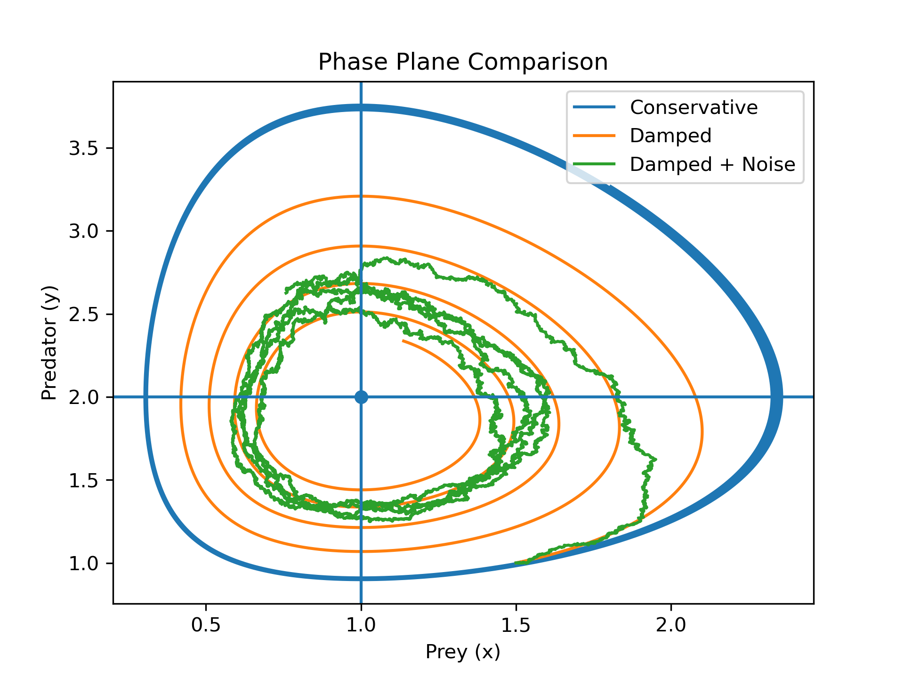
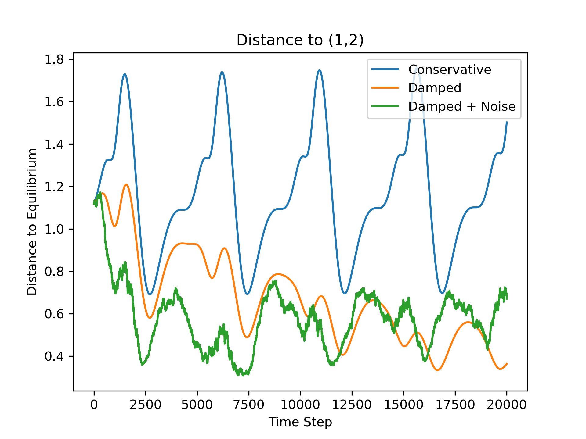

# Predator–Prey Dynamics  
## From Conservative Oscillations to Noisy Stable Systems

This project studies the transition from conservative oscillations to damped and stochastic dynamics in a predator–prey system.

---

## Mathematical Model

We analyze the system:

x' = x(2 - y) - α x²  
y' = y(x - 1)

We compute:

- Equilibrium points  
- Jacobian matrix  
- Eigenvalues  
- Stability conditions  

---

## Numerical Experiments

We compare three cases:

1. Conservative system (no damping, no noise)  
2. Damped system  
3. Damped + stochastic noise  

We analyze:

- Phase plane trajectories  
- Distance to equilibrium  
- Effect of numerical methods  

---

## Goal

To understand how damping and stochastic perturbations modify the qualitative behavior of nonlinear dynamical systems.
## Results

### Phase Plane

### Distance to Equilibrium

